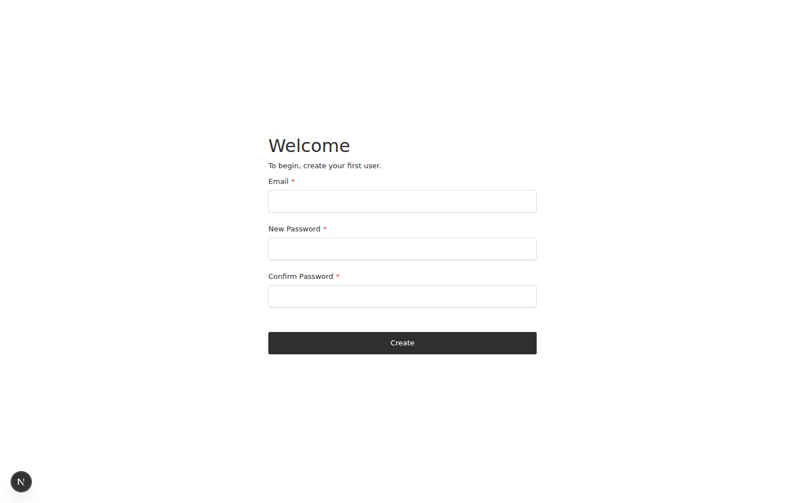

# Payload 3.x kitchen sink + DynamoDB

Kitchen-sink [Payload](https://payloadcms.com) **3.84.1** app using **payloadcms-db-dynamo** against DynamoDB Local.

- **Admin:** [http://localhost:3000/admin](http://localhost:3000/admin)
- **Table:** `payload-kitchen-sink-3` (see `.env.example`)

## Run

From repo root: `npm run example:3x`

Or in this directory: `npm run dev` (port **3000**; `predev` runs `setup`). Stop with `npm run stop`.

Both this app and [payload-4.x](../payload-4.x) can run together; they use different ports and DynamoDB table names.

## Collections

Users, Media, posts (drafts, geo, search), authors, tags, categories (join), places, pages (localized), docs (blocks), articles, and globals `site`, `header`, `settings`.
