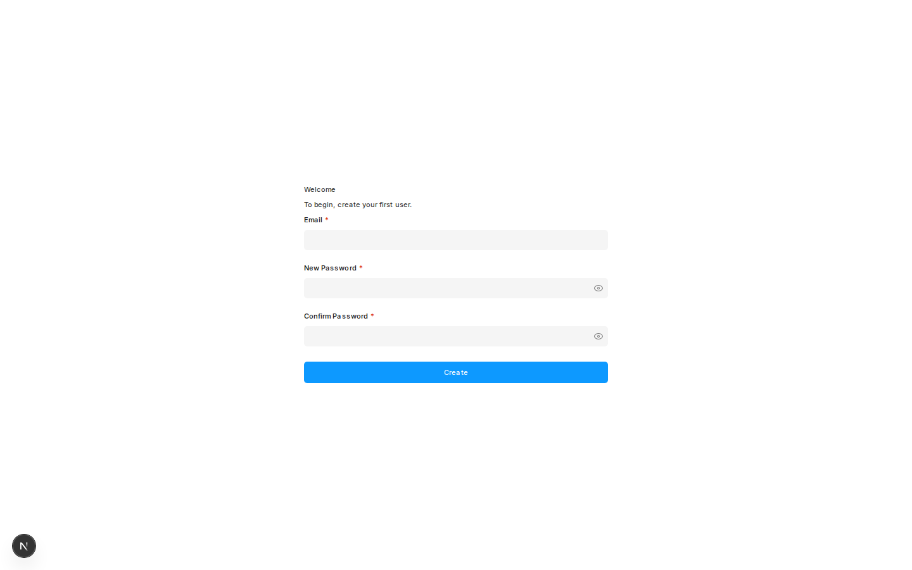

# Payload 4.x kitchen sink + DynamoDB

Kitchen-sink [Payload](https://payloadcms.com) **4.0.0-internal.e16cf59** app using **payloadcms-db-dynamo** against DynamoDB Local (same internal build as CI).

- **Admin:** [http://localhost:3001/admin](http://localhost:3001/admin)
- **Table:** `payload-kitchen-sink-4` (see `.env.example`)

## Run

From repo root: `npm run example:4x`

Or in this directory: `npm run dev` (port **3001**; `predev` runs `setup`). Stop with `npm run stop`.

Dev uses `next dev --webpack` (Turbopack cannot resolve the local `file:../..` adapter).

## Collections

Same kitchen-sink schema as [payload-3.x](../payload-3.x); see `src/kitchenSink.ts` (synced from [`../shared/kitchenSink.ts`](../shared/kitchenSink.ts)).
